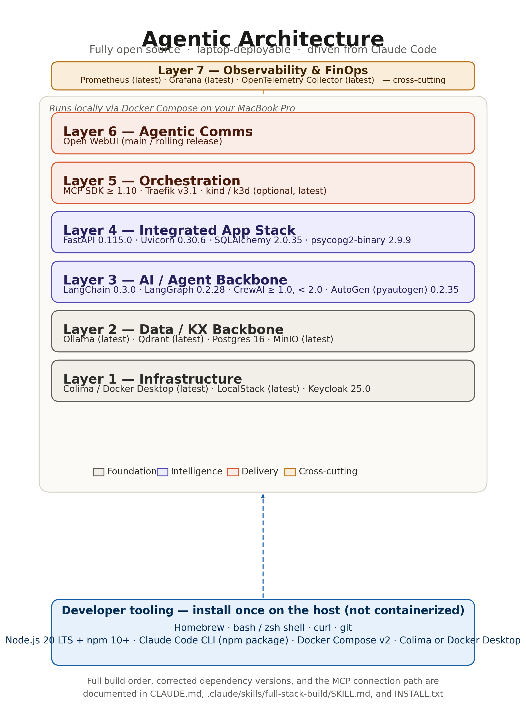

# AI-Native SDLC Reference Architecture — open source, laptop-deployable

A fully open source, self-contained implementation of the 7-layer reference
architecture (Infrastructure → Data/KX → AI/Agent Backbone → Integrated App
Stack → Orchestration → Agentic Comms → Observability/FinOps), designed to
run on a MacBook Pro and to be driven end-to-end from **Claude Code**.




Every box in the original diagram maps to a real open source tool — no
hosted SaaS, no API keys to a third party required to get the whole thing
running:

| # | Layer | Open source implementation |
|---|---|---|
| 1 | Infrastructure | Colima/Docker (compute) · LocalStack (AWS emulation) · Keycloak (IAM) |
| 2 | Data / KX Backbone | Ollama (local LLM/SLM) · Qdrant (vector DB) · Postgres · MinIO |
| 3 | AI / Agent Backbone | LangChain · LangGraph · CrewAI · AutoGen, served via FastAPI |
| 4 | Integrated App Stack | FastAPI domain-integration stub (CRM-shaped), swappable for Twenty CRM / EspoCRM / ERPNext |
| 5 | Orchestration | MCP server (real Model Context Protocol) · Traefik · optional kind/k3d |
| 6 | Agentic Comms | Open WebUI |
| 7 | Observability & FinOps | Prometheus · Grafana · OpenTelemetry Collector |

`CLAUDE.md` and `.claude/skills/` teach Claude Code the conventions of this
repo, so it can implement new features in the right layer, the right way,
without re-explaining the architecture every session.

## Requirements

- MacBook Pro, macOS Ventura (13.x)
- 16GB RAM recommended for the `core` profile comfortably; 8GB works with a
  small model (see layer 2's skill for sizing); `full` profile wants 32GB.
- ~20GB free disk (container images + a couple of local models)
- [Homebrew](https://brew.sh)
- [Claude Code](https://docs.claude.com/en/docs/claude-code)

## First-time setup

```bash
chmod +x scripts/*.sh
./scripts/setup-mac.sh
```

This installs Colima (a lightweight, license-free Docker Desktop
alternative) and Docker CLI via Homebrew, starts Colima with laptop-sized
resource limits, brings up the `core` profile (Ollama, Qdrant, Postgres,
agent-service, Open WebUI), and pulls a default local model.

If you'd rather use Docker Desktop instead of Colima, just install it
yourself and skip straight to `docker compose --profile core up -d` — the
rest of the setup script still applies.

## Running the stack

```bash
cp .env.example .env               # adjust only if you changed defaults

docker compose --profile core up -d           # layers 1-3 essentials + chat UI
docker compose --profile orchestration up -d  # adds the MCP server + gateway
docker compose --profile observability up -d  # adds Prometheus/Grafana
docker compose --profile full up -d           # everything at once (32GB+ RAM)

./scripts/health-check.sh                     # confirms what's up
```

Profiles: `core`, `infrastructure`, `data`, `agents`, `apps`,
`orchestration`, `comms`, `observability`, `full`. Combine any of them —
`docker compose --profile core --profile observability up -d`.

## Connecting this to Claude Code

Once the `orchestration` profile is running:

```bash
claude mcp add sdlc-stack --transport http http://localhost:8003/mcp
```

Claude Code can now call the local LLM, run RAG queries against Qdrant, and
read/write the CRM stub directly as tools — and, per `CLAUDE.md`, knows
which layer and skill to use when you ask it to extend the architecture
(e.g. "add an order-management endpoint" → layer 4 → `integrated-app-stack`
skill; "add a document-ingestion pipeline" → layer 2 →
`data-kx-backbone` skill).

## Where things live

```
docker-compose.yml          all services, organized by layer, gated by profile
CLAUDE.md                   architecture map + conventions Claude Code reads automatically
.claude/skills/<layer>/     one skill per layer with implementation patterns and gotchas
layers/<n>-<name>/          each layer's services, Dockerfiles, and README
scripts/                    setup-mac.sh, health-check.sh
ci-cd/services.yaml         config telling the external cicd-tooling-architecture pipeline what to build
.github/workflows/          thin wrappers (~6 lines each) that call cicd-tooling-architecture's reusable workflows
```

## CI/CD

The pipeline itself lives in a separate, standalone repo —
[`cicd-tooling-architecture`](https://github.com/Voyce007/cicd-tooling-architecture)
— so it isn't specific to this stack and can be reused elsewhere. This
repo only carries two things: `ci-cd/services.yaml` (which of *this*
repo's services get built/scanned/released, and how) and a pair of
6-line wrapper workflows in `.github/workflows/` that call the tooling
repo's reusable workflows. The workflows currently point at
`Voyce007/cicd-tooling-architecture@v1` — that repo doesn't exist yet, so
CI will fail until it's created and tagged `v1`; see the tooling repo's
README, "Before you use this for real", for the full swap-and-tag
instructions.
See `ci-cd/services.yaml` for the current config and the tooling repo's
`adapters/ai-sdlc/INTEGRATION.md` for how the two are wired together.

### Running the pipeline locally

You don't need a checkout of `cicd-tooling-architecture` to exercise what
its pipeline does — everything it builds, scans, and smoke-tests for this
repo is driven from `ci-cd/services.yaml`, and every path in that file is
relative to *this* repo. The commands below reproduce each CI stage using
only what's already here:

```bash
# Build every service the pipeline builds
docker build -t local/agent-service:dev      layers/3-ai-agent-backbone/agent-service
docker build -t local/mock-crm-service:dev   layers/4-integrated-app-stack/mock-crm-service
docker build -t local/mcp-server:dev         layers/5-orchestration/mcp-server

# Vulnerability scan (matches the CRITICAL/HIGH gate in CI)
brew install trivy      # one-time
trivy image local/agent-service:dev
trivy image local/mock-crm-service:dev
trivy image local/mcp-server:dev

# Smoke-test: bring up exactly the profiles services.yaml's smoke_profiles
# lists (core + apps + orchestration), then hit each service's health check
docker compose --profile core --profile apps --profile orchestration up -d --build
curl http://localhost:8001/health   # agent-service
curl http://localhost:8002/health   # mock-crm-service
curl http://localhost:8003/mcp      # mcp-server — a 4xx body here (e.g. "Client
                                     # must accept text/event-stream") is success,
                                     # not a bug; see the full-stack-build skill
docker compose down -v
```

This is the same matrix `ci.yml` generates from `ci-cd/services.yaml` —
if a service is added there, add its build/curl lines here too.
Signing (Cosign) and release bundling only run on a tag push through the
actual GitHub Actions workflow and aren't practical to reproduce locally.

## Endpoints once running

| Layer | Service | URL |
|---|---|---|
| 1 | LocalStack | http://localhost:4566 |
| 1 | Keycloak | http://localhost:8080 |
| 2 | Ollama | http://localhost:11434 |
| 2 | Qdrant | http://localhost:6333 |
| 2 | MinIO console | http://localhost:9001 |
| 3 | agent-service | http://localhost:8001 |
| 4 | mock-crm-service | http://localhost:8002 |
| 5 | mcp-server | http://localhost:8003/mcp |
| 5 | Traefik dashboard | http://localhost:8090 |
| 6 | Open WebUI | http://localhost:3000 |
| 7 | Prometheus | http://localhost:9090 |
| 7 | Grafana | http://localhost:3001 |

## Notes on fidelity to the original diagram

- **Google ADK** has no open source release — `LangGraph` fills the same
  "structured agent graph" role instead (documented in the layer 3 skill).
- **"Closed LLM/SLM"** is implemented as fully local models via Ollama:
  nothing leaves your laptop, which satisfies the same intent as a
  closed/sovereign model without a hosted dependency.
- **CRM/ERP** is a structurally-realistic stub by default, so the repo
  stays laptop-light; swap in Twenty CRM/EspoCRM/ERPNext when you want the
  real thing (see layer 4's skill for how to do that without touching
  layers 3/5/6).
- **Kubernetes** is optional (`kind`/`k3d`) rather than always-on — running
  a full k8s cluster alongside everything else is more than most laptops
  want by default; docker-compose plays the "orchestration" role day to
  day, and the layer 5 skill covers standing up real k8s when a task
  specifically needs it.
